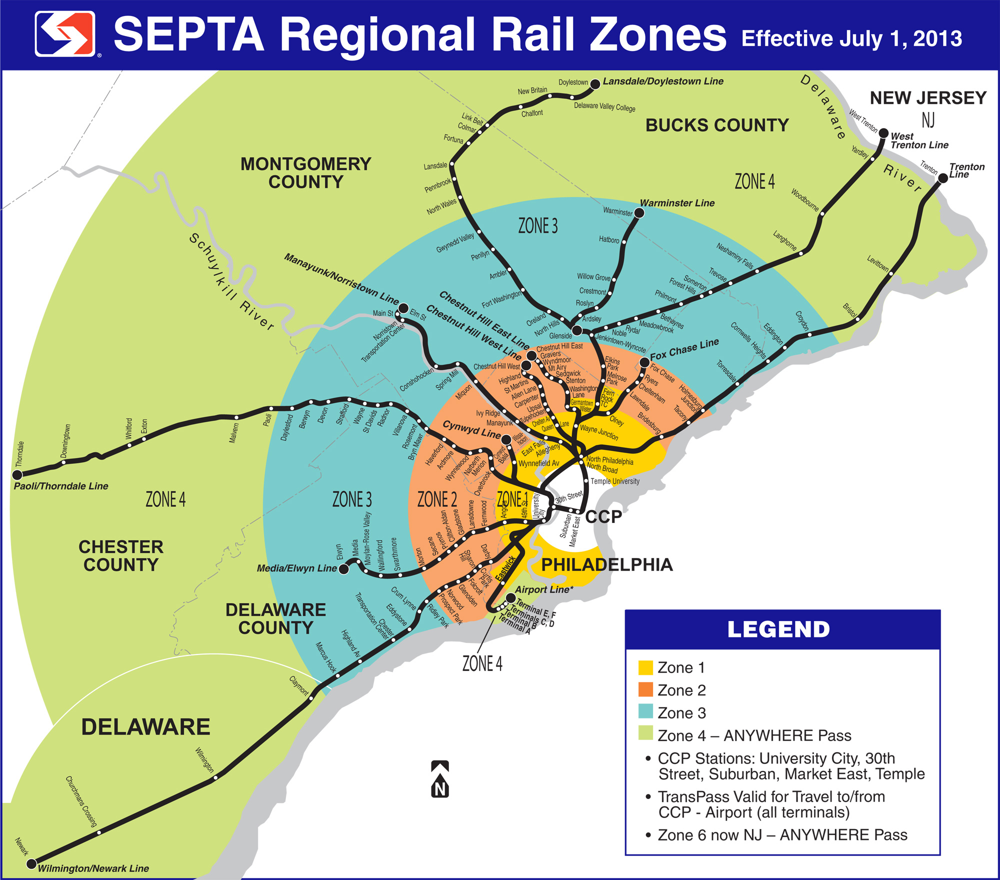
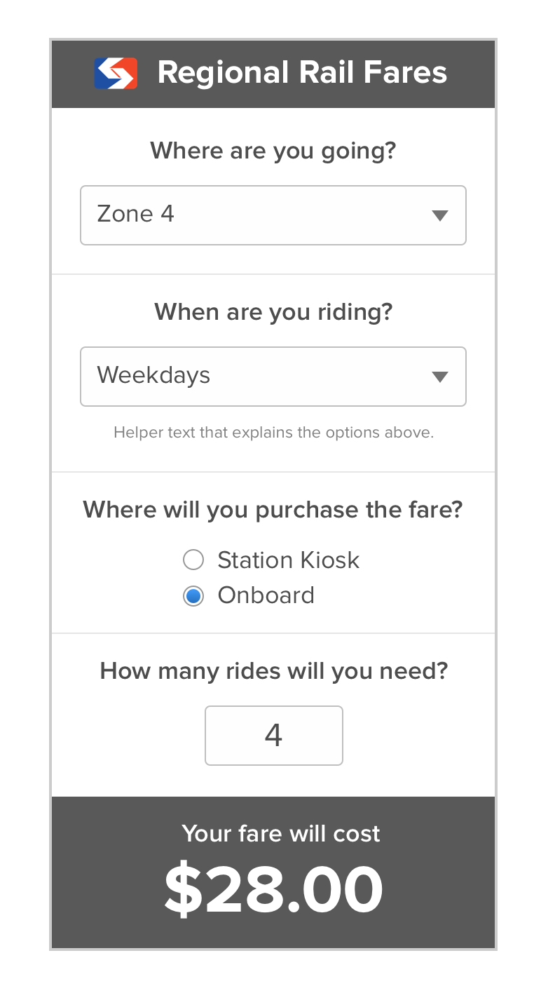

# SEPTA Rail Fare Calculator Challenge

Hello, hopeful Think Brownstone development team member! 

Thank you for taking time to help us assess your front-end development skills. Part of the work we frequently are tasked with is combining complex business data with our design team's fresh new interfaces. Our development team makes these come to life with semantic, accessible HTML, CSS, and JavaScript. All of our philosophies are documented in [our standards](https://bitbucket.org/thinkbrownstone/tbi_dev-standards/src).

Your challenge is to create an interactive widget for calculating SEPTA Regional Rail fare prices. (In case you're not familiar with Philadelphia's preeminent mass transit agency, here are all the railroads in map form.)

 

When you take regional rail in and out of the city, the fare price is affected by where you purchase the ticket, when you ride, and how far you travel. You can learn more about the details on [SEPTA's website](http://www.septa.org/fares/ticket/index.html) -- or trust that we've correctly compiled this information into this [JSON file](fares.json). We'd like you to make this information easier to understand by making an interactive fare purchase widget, illustrated in the screenshot below.

## Instructions
* Develop the HTML and CSS for the widget seen in the screenshot above. Feel free to make this responsive, and keep accessibility in mind.
* Assume that your code would be handed off to a back-end developer for integration. It could end up on a page with other content and widgets, so keep this in mind when you are making decisions about naming conventions.
* Write JavaScript to request [fares.json](fares.json) via AJAX and populate the widget with live data. End users should be able to see the fare total update when they use the widget controls.
* We care more about functionality than style - we'd rather see a partially-styled working prototype than a pixel-perfect widget that isn't doing fare calculations. Try to balance your time appropriately!
* It should go without saying - please comment your code to state any assumptions or decisions you're making during this assignment -- or just to say hi. :-)

## Requirements
* *Browser Support*: Internet Explorer 8+, Google Chrome, Firefox, Safari for iOS, and Chrome for Android.
* *Libraries & Frameworks*: You are welcome to bring in JavaScript libraries (like jQuery) or frameworks (like Angular or React). You may also author your JS with vanilla DOM methods, as long as they are compatible with the browser requirements. Please don't include an entire CSS framework like Bootstrap -- we want to see your HTML and CSS, not theirs.
* *Standards*: Your solution should be valid, semantic, accessible, and performant. To get an idea of what how we're doing things, please feel free to review our [development standards](https://bitbucket.org/thinkbrownstone/tbi_dev-standards/src).
* *Time*: Please limit yourself to 60 minutes to work on your solution. We don't expect you to overexert yourself to deliver a perfectly finished product!
* *Submission*: Fork this repository and make a pull request for us to review your code. If you're not familiar with git or Github, you can download this repo and send us a ZIP file when you're done.

## Resources
* [Think Brownstone Development Standards](https://bitbucket.org/thinkbrownstone/tbi_dev-standards/src)
* [SEPTA Fares](http://www.septa.org/fares/ticket/index.html)
* [SEPTA Logo (SVG)](https://commons.wikimedia.org/wiki/File:SEPTA.svg)